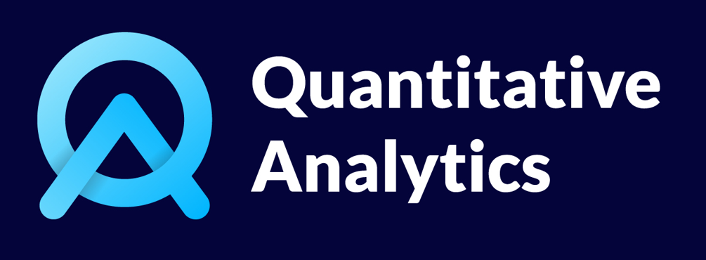

<h1 align="center">

</h1><br>

<tr>
  <td><a href="https://github.com/matt-charr/qAPP/stargazers">
  </td>
  <td><a href="https://github.com/matt-charr/qAPP/network/members">
  </td>
  <td><a href="https://github.com/matt-charr/qAPP/watchers">
  </td>
  <td><a href="https://github.com/matt-charr/qAPP/issues">
  </td>
</tr>
<br>
<tr>
  <td><a href="https://twitter.com/matt_charr" alt="twitter"></a></td>
  <td><a href="https://www.twitch.tv/mattcharr" alt="twitch"></a></td>
  <td><a href="https://www.linkedin.com/in/matthieu-charrier-080820134/" alt="linkedin"></a></td>
  <td><a href="https://github.com/matt-charr/" alt="GitHub"></a></td>
</tr>
<br>
<tr>
  <td><a href="" alt="C"></a></td>
  <td><a href="" alt="C++"></a></td>
  <td><a href="" alt="MariaDB"></a></td>
</tr>
<br>
<tr>
  <td><a href="" alt="Windows"></a></td>
  <td><a href="" alt="Linux"></a></td>
  <td><a href="" alt="MacOS"></a></td>
</tr>
<br>
<tr>
  <td><a href="" alt="GitHubActions"></a></td>
  <td><a href="" alt="Hostinger"></a></td>
</tr>

# 📋 Table of Contents

1. 💥 [Genesis](#genesis)
2. ⚡️ [Quick Start](#quick-start)
3. 🌴 [Features](#features)
   1. 📝 [List of features](#list-of-features)
   2. 🤝 [Missing a specific feature ?](#missing-a-specific-feature-?)
   3. 🔎 [Found a bug ?](#found-a-bug-?)
4. 🙌 [How can I contribute ?](#how-can-i-contribute-?)
5. 💻 [Insights](#insights)
   1. 🍯 [Developement](#developement)
   2. 🍏 [Build](#build)
   3. 🍊 [Tests](#tests)
   4. 🍈 [Continuous Integration](#continuous-integration)
   5. 🍇 [Continuous Delivery](#continuous-delivery)
6. 📜 [Licence](#licence)

# <a name="genesis">Genesis</a>

<div align="center">
<em>"Design, price and manage your own exotic financial derivatives contracts"</em>
</div> <br>

🎮 `𝐪𝐀𝐏𝐏` (Quantitative Analytics Application) is a simple ecosystem of devices that helps the users to 𝑏𝑢𝑖𝑙𝑑, 𝑝𝑟𝑖𝑐𝑒 and 𝑎𝑛𝑎𝑙𝑦𝑠𝑒 customized financial derivatives contracts.

✍🏻 This flowcharts shows the architecture of the project together with which components the user can consume.

⏩ **𝑞𝐶𝑂𝑅𝐸** (<em>private</em>) is the aggregation of embedded private libraries in charge of implementing 𝘤𝘰𝘯𝘵𝘳𝘢𝘤𝘵, 𝘥𝘢𝘵𝘢, 𝘮𝘰𝘥𝘦𝘭 and 𝘱𝘳𝘪𝘤𝘦𝘳 architectures. Its codebase is hosted on a private GitHub repository which access is restricted to our developpers only.

⏩ **𝑞𝐴𝑃𝐼** (<em>public</em>) is the shared object that the user can plug into his or her personal project. A library of functions that request the core to perform generic actions such as getting contract information, getting price and greeks ...

⏩ **qDSL** (<em>public</em>) is the internal contract description that uses the power of domain-specific language. A language easily understandable by human and machine to design your contract from a self-explanatory script. The whole ecosystem is built around this.

⏩ **𝑞𝐺𝑈𝐼** (<em>public</em>) is the up and running GUI desktop application from which the user requests the API and visualize the results through a modern graphical interface.


# <a name="quick-start">⚡️ Quick Start</a>

To download the latest version of our application, go to [Releases](https://github.com/matt-charr/qAPP/releases) and download the asset that corresponds to your operating system. After extracting all the files into a nice location of your machine, you are falling onto a folder that contains `qAPP` directory. Open the `qGUI` executable located at <em>qAPP/bin</em> and you arrive to the main page with an example. 

# <a name="features"> 🌴 Features</a>

## <a name="list-of-features">📝 List of features</a>

1. 📺 [How to plug qAPI with my project ?](posts/20240401.md)
2. 📺 [How to use the ladders ?](posts/20240407.md)
3. 📺 [How to use the Heston parameters smile impact viewer ?](posts/20240417.md)

## <a name="missing-a-specific-feature-?">🤝 Missing a specific feature ?</a>

The project is very far from being complete (and will probably never be ...) and a loads of features are still missing. This is why our developpers are working continuously to enrich the list of available functionalities. Feel free to [share your ideas](https://github.com/matt-charr/qAPP/issues) under the tag <em>features</em> ! We are happy to discuss with you about your personnal needs and the feasibility of your project.

> [!NOTE]
> If your idea is considered as doable by our team, be sure that your request will be added to our stack. But please kindly understand that we cannot give any ETA since our developers are working for `qAPP` as volunteers aside their job and our backlog is already populated by a thousand of new fields to explore.

## <a name="found-a-bug-?">🔎 Found a bug ?</a>

Feel free to [report your issue](https://github.com/matt-charr/qAPP/issues) (see [How can I report my issue](features/how-can-i-report-my-issue/doc.md)) with a respective title and an understandable description.

> [!IMPORTANT]
> `qAPP` embbeds a mecanism to save and open your current `mockup` for further usage. If possible please attach your `mockup` file together with the relevant data json and contract external files in your issue, it helps our developpers to reproduce the bug and increase the chances for us to sort it quickly. See [How can I report my issue](features/how-can-i-report-my-issue/doc.md) for further details on how to proceed.

# <a name = "how-can-i-contribute-?"> 🙌 How can I contribute ?</a>

We are building a payoff base to:
- Challenge our tool and push it to its limits.
- Enhance our unit and integration tests.

We propose to every structured products and programmer enthusiasts to contribute its favorite payoff within a shared folder. Here is the process to follow:

- Design your contract (see [How can I design my contract](doc/how_can_i_design_my_contract.md))

- Fork and clone this repository.

```bash
git clone https://github.com/matt-charr/qAPP.git
```

- Drop your contract python file(s) into <em>qAPP/factory</em> folder.

```bash
mv my_contract.py qAPP/factory/my_contract.py
```

- Commit, push and pull request.

```bash
cd qAPP 
git commit -am "Added my contract"
git push origin master
```

# <a name="work-style">💻 Insights</a>

## <a name="developement"> 🍯 Developement</a>

Once a bug or a feature is submitted, an issue is created with the corresponding flag (<em>bug</em>, <em>feature</em>, <em>project</em>, <em>activity</em>, <em>misc</em>). Once picked from the stack, a dev branch is created, comes down locally to the developper machine and this is where the fun begins 😃

## <a name="build"> 🍏 Build</a>

`qAPP` uses [CMake](https://cmake.org/) as a build system and has its main code base located on a private repository which access is restricted to our developers only. Besides, it relies on a bunch of repository dependencies that are required at `qAPP` build time. <br> 
It is to the following projects that we owe our heartfelt thanks for their generous open source contribution.

- [ImGui](https://github.com/matt-charr/imgui-for-qa)
- [ImPlot](https://github.com/matt-charr/implot-for-qa)
- [ImFileBrowser](https://github.com/matt-charr/imfilebrowser-for-qa)
- [MariaDB](https://github.com/matt-charr/mariadb-for-qa)
- [Curl](https://github.com/matt-charr/curl-for-qa)
- [OpenSSL](https://github.com/matt-charr/ssl-for-qa)
- [Glfw](https://github.com/matt-charr/glfw-for-qa)
- [JsonCpp](https://github.com/matt-charr/jsoncpp-for-qa)
- [Eigen](https://github.com/matt-charr/eigen-for-qa)

To load the below dependencies, `qAPP` uses the power of [superbuild](https://cmake.org/cmake/help/latest/module/ExternalProject.html) feature from CMake. For that purpose, an embedded CMake project is in charge of cloning, building and installing all the dependencies that `qAPP` requires into a specific folder. That's pretty cool, isn't it ? 😃

## <a name="tests"> 🍊 Tests</a>

In order to ensure that the code change effect is not broken by any subsequent modifications, at the end of each dev session, a new unit test is required to be submitted to the test suite together with a contract file that replicates the expected behavior of the code change.

## <a name = "continuous-integration">🍈 Continuous Integration</a>

`qAPP` embbeds a custom GitHub action that runs at each pull requests. Once a pull request is submitted, build and tests are triggered on our Windows, Linux and MacOS self-hosted runners in Debug/Release mode with the below configurations. A dev branch is merged if and only if all builds and tests passed on all tested configurations.

| Name        | OS           | Provider                              | RAM     | CMake        | CMake Generator       | Build Type      | Compiler           | Build Status |
| ----------- | ------------ | ------------------------------------  | ------- |------------- | --------------------- | --------------- | ------------------ | ------------ | 
| Win32-MinGW | Windows 10   | -                                     | 8.00 GB | CMake-3.28.3 | MinGW Makefiles       | Release & Debug | GCC-13.2.0         | ✅           |
| Win32-MSVC  | Windows 10   | -                                     | 8.00 GB | CMake-3.28.3 | Visual Studio 17 2022 | Release & Debug | MSVC-19.30.30709.0 | ✅           |
| Linux       | Ubuntu 22.04 | [Hostinger](https://www.hostinger.fr) | 8.00 GB | CMake-3.22.1 | Unix Makefiles        | Release & Debug | GCC-11.4.0         | ✅           |
| MacOS       | Sonoma 14.4  | [UltaHost](https://ultahost.com)      | 2.00 GB | CMake-3.28.3 | Unix Makefiles        | Release & Debug | CLANG-1500.3.9.4   | ✅           |


## <a name="continuous-delivery">🍇 Continuous Delivery</a>

Our team delivers a release on a weekly basis:

- ~One <strong>major</strong> release per year (coming out with the current <em>project</em>)
- ~One <strong>minor</strong> release per month (coming out with the current <em>feature</em>)
- ~One <strong>patch</strong> release per week (coming out with the current <em>bug</em>)
   
To publish a new release, each tag created on our developement repository triggers a github actions that for each OS supported will create and upload the package to [qAPP](https://github.com/matt-charr/qAPP).

> [!IMPORTANT]
> We are far from being CD experts and know that our solution looks like a rush, better ways of releasing probably exist such as deploying binaries to a more convenient location than GitHub or building on a dedicated production environement. You are more than welcome to suggest improvements or just simply share your CD work styles. 

# <a name="licence">📜 Licence</a>

```text
Copyright © 2024 qAPP - Quantitative Analytics. All rights reserved.
This file is part of the project qAPP - Quantitative Analytics Application. 
Hence the latter remains the exclusive property of its author. 
Accordingly, no part of this document may be used or transmitted 
in any form for professional, educational or commercial purposes 
without the express permission of Matthieu Charrier.
```

---

🙌 Feedbacks more than welcome. <br>
⭐ Star the project on GitHub helps it to progress. <br>
🔔 Reach us at https://github.com/matt-charr/qAPP/issues if: <br>
⚫ You need 𝘀𝗼𝗺𝗲 𝗵𝗲𝗹𝗽 𝘁𝗼 𝘀𝘁𝗮𝗿𝘁. <br>
⚫ You want to 𝗽𝗿𝗼𝗽𝗼𝘀𝗲 𝗮 𝗻𝗲𝘄 𝗳𝗲𝗮𝘁𝘂𝗿𝗲. <br>
⚫ You want to 𝘀𝘂𝗯𝗺𝗶𝘁 𝗮 𝗰𝗼𝗻𝘁𝗿𝗮𝗰𝘁. <br>
⚫ You want to 𝗿𝗲𝗽𝗼𝗿𝘁 𝗮𝗻 𝗶𝘀𝘀𝘂𝗲. <br>
