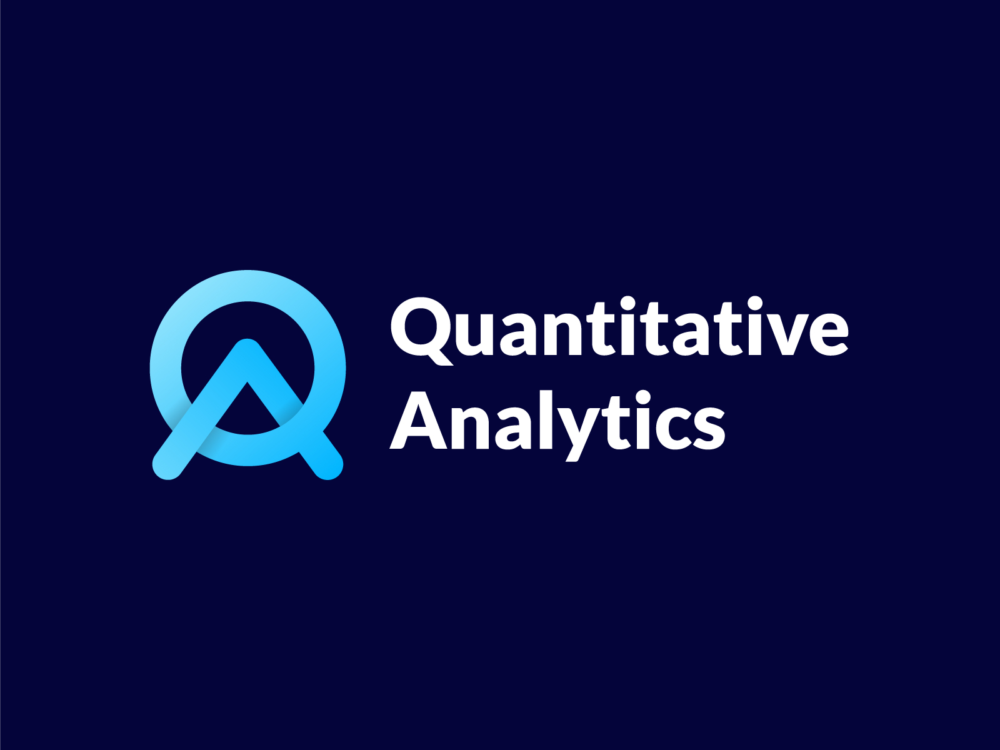
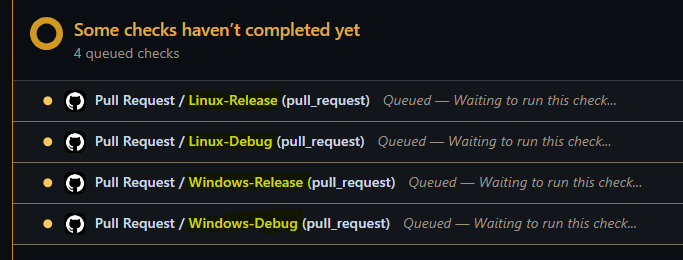

<div align="center">
  <div>
    
  </div>
</a>

# QA

<em>Design, monitor and price your own financial contracts.</em>

</div>

# 🍺 Project Status

<table class="no-border">
  <tr>
    <td><a href="https://github.com/matt-charr/qa-demo/stargazers">
    </td>
    <td><a href="https://github.com/matt-charr/qa-demo/network/members">
    </td>
    <td><a href="https://github.com/matt-charr/qa-demo/watchers">
    </td>
    <td><a href="https://github.com/matt-charr/qa-demo/issues">
    </td>
  <tr>
    <td><a href="https://twitter.com/matt_charr" alt="twitter"></a></td>
    <td><a href="https://www.twitch.tv/mattcharr" alt="twitch"></a></td>
    <td><a href="https://www.linkedin.com/in/matthieu-charrier-080820134/" alt="linkedin"></a></td>
    <td><a href="https://github.com/matt-charr/" alt="GitHub"></a></td>
  <tr>
  <tr>
    <td></td>
    <td></td>
    <td></td>
  </tr>
  <tr>
    <td></td>
    <td></td>
    <td></td>
  </tr>
  <tr>
    <td></td>
    <td></td>
  </tr>
</table>

⭐ Star the project on GitHub helps it to progress.

<td>
<h3>📰 Latest news </h3>
<ul>
  <li> <ins>2023-12-17</ins>
<ul>
    <li> 🔔(<strong>Release</strong>) <a href="https://github.com/matt-charr/qa-demo/releases">qa-v0.1.1</a> is out 🚀</li>
</ul>
</ul>
</td>

<td>
<h3>👷 Current work </h3>
<ul>
<li> <ins>2023-12-03</ins>
<ul>
    <li>📗(<strong>Project</strong>) Handling early exercise feature. </li>
    <li>📙(<strong>Feature</strong>) Making Static replication 1D pricer.</li>
    <li>📘(<strong>Misc</strong>) Handling intraday fixings/payments/exercises.</li>
    <li>📕(<strong>Issue</strong>) Checking why remote database connection takes so long</li> 
</ul>
</ul>
</td>

## 📋 Table of Contents

1. 💥 [Introduction](#introduction)
2. ⚡️ [Quick Start](#quick-start)
3. 🌴 [Features](#features)
   1. 📝 [List of features](#list-of-features)
   2. 🤝 [Missing a specific feature ?](#missing-a-specific-feature-?)
   3. 🔎 [Found a bug ?](#found-a-bug-?)
4. 🙌 [How can I contribute ?](#how-can-i-contribute-?)
5. 💻 [Insights](#insights)
   1. 🍯 [Developement](#developement)
   2. 🍏 [Build](#build)
   3. 🍊 [Tests](#tests)
   4. 🍈 [Continuous Integration](#continuous-integration)
   5. 🍇 [Continuous Delivery](#continuous-delivery)
6. 📜 [Licence](#licence)

# <a name="introduction">💥Introduction</a>

`QA-Quantitative Analytics` is an ecosystem of components that helps you with designing, monitoring and pricing your own financial derivatives.

- **qacore** (<em>private</em>) -- The core library of the project that is the agregation of embedded libraries in charge of implementing <em>contract</em>, <em>data</em>, <em>modeling</em> and <em>pricing</em> engine.

- **qapp** (<em>public</em>) -- The GUI desktop application through which the user can interact with `qacore` and send all kind of request such as pricing a contract, feed a database, see model calibration results, inspect the contract lifetime events and much more.

- **qalgebra** (<em>private</em>) -- `qacore` uses the power of algebraic contract description and `qalgebra` is the library that implements it: A customized language easily understandable by human and machine to design your contract with a self-explanatory script. Thanks to qalgebra, the user can write down a contract using this simple language and send it to `qa`  to run any generic actions such as pricing, monitoring and much more. The whole `qa` ecosystem is built arround `qalgebra` device.

- **qafactory** (<em>public</em>) -- For the users to benefit their own `qalgebra` experience and price their own contracts, our developpers created [qa-factory](https://github.com/matt-charr/qa-factory), a friendly repository where all programmer enthusiasts can use and contribute its favorite payoff functions and contracts to eventually use it from `qapp`. This game room is yours, feel free to populate and use it at your convenience.

# <a name="quick-start">⚡️ Quick Start</a>

To download the latest version of our application, go to [Releases](https://github.com/matt-charr/qa-demo/releases) and download the asset that corresponds to your operating system. After extracting all the files into a nice location of your machine, you are falling onto a folder that contains `qa` directory. Open the `qapp` executable located at <em>qa/bin</em> and you arrive to the main page. 

On the left hand side of the screen is located a logger that displays the messages that `qacore` returns after each actions.

Each action triggers by `qapp` - typically pressing a button - throws <FONT COLOR="BLUE"><em>information</em></FONT>, <FONT COLOR="GREEN"><em>warnings</em></FONT>, <FONT COLOR="ORANGE"><em>errors</em></FONT> and/or <FONT COLOR="RED"><em>exceptions</em></FONT>.
- If an <FONT COLOR="RED"><em>exception</em></FONT> is thrown, it means something went wrong dev side. In that case please [report your issue](https://github.com/matt-charr/qa-demo/issues) by dropping your `mockup` file together with your contract and data json files if any (see [How can I report my issue](features/how-can-i-report-my-issue/doc.md)).
- If an <FONT COLOR="ORANGE"><em>error</em></font> is thrown, it means that something went wrong user side and `qacore` did not manage to perform your request. In that case you need to check the log and correct your request accordingly.
- If a <FONT COLOR="GREEN"><em>warning</em></font> is thrown, it means that something went wrong user side but `qacore` managed to perform the request.
At inception, an action always thrown an <FONT COLOR="BLUE"><em>information</em></FONT> message to the user such as "Pricing contract...", the goal is to inform what action `qapp` is performing.
When the action is over, a <FONT COLOR="YELLOW"><em>success</em></font> is thrown if an only if no error or exception occured during the action lifetime.

# <a name="features"> 🌴 Features</a>

## <a name="list-of-features">📝 List of features</a>

1. 📺 [How can I report my issue ?](features/how-can-i-report-my-issue/doc.md)
2. 📺 [How can I build my contract ?](features/how-can-i-build-my-contract/doc.md)
3. 📺 [How can I load my contract ?](features/how-can-i-load-my-contract/doc.md)
4. 📺 [How can I move my contract ?](features/how-can-i-move-my-contract/doc.md)
5. 📺 [How can I edit my fixings ?](features/how-can-i-edit-my-fixings/doc.md)
6. 📺 [How can I manage my data sources ?](features/how-can-i-manage-my-data-sources/doc.md)
7. 📺 [How can I feed my data sources ?](features/how-can-i-feed-my-data-sources/doc.md)
8. 📺 [How can I display my observable ?](features/how-can-i-display-my-observable/doc.md)
9. 📺 [How can I price my contract with Monte Carlo ?](features/how-can-i-price-my-contract-with-monte-carlo/doc.md)
10. 📺 [How can I inspect my Monte Carlo ?](features/how-can-i-inspect-my-monte-carlo/doc.md)

## <a name="missing-a-specific-feature-?">🤝 Missing a specific feature ?</a>

The project is very far from being complete (and will probably never be ...) and a loads of features are still missing. This is why our developpers are working continuously to enrich the list of available functionalities. Feel free to share your ideas! We are happy to discuss with you about your personnal needs and the feasibility of your project.

> [!NOTE]
> If your idea is considered as doable by our team, be sure that your request will be added to our stack. But please kindly understand that we cannot give any ETA since our developers are working for `qa` as volunteers aside their job and our backlog is already populated by a thousand of new fields to explore.

## <a name="found-a-bug-?">🔎 Found a bug ?</a>

Feel free to [report your issue](https://github.com/matt-charr/qa-demo/issues) (see [How can I report my issue ?](features/how-can-i-report-my-issue/doc.md)) with a respective title and an understandable description. For any questions, you can always reach out to us directly via our [twitter](https://twitter.com/matt_charr) or post your question on [QuantStackExchange](https://quant.stackexchange.com/questions/tagged/qa) with the official `qa` tag.

> [!IMPORTANT]
> `qa` embbeds a mecanism to save and open your current `mockup` for further usage. If possible please attach your `mockup` file together with the relevant data json files and contract cpp/json files in your issue, it helps our developpers to reproduce the bug and increase the chances for us to be sort it quickly. See [How can I report my issue ?](features/how-can-i-report-my-issue/doc.md) for further details on how to proceed.

# <a name = "how-can-i-contribute-?"> 🙌 How can I contribute ?</a>

`qa-factory` is a repository where you can:

- Contribute your payoff functions (<em>src/</em> and <em>include/</em>) and your contracts (<em>tests/</em>).

1. Fork the [repo](https://github.com/matt-charr/qa-factory).
2. Clone your fork.

```bash

# clone qa-factory repository.
git clone https://github.com/matt-charr/qa-factory.git

```

4. Make your masterpeace.
5. Submit your pull request.

- Use additionnal features (functions) provided by other users to ease your contract design.

In order to do this, you just need to clone it inside your <em>factory</em> directory.

```bash

# go to factory.
cd factory &&

# clone qa-factory repository.
git clone https://github.com/matt-charr/qa-factory.git

```

# <a name="work-style">💻 Insights</a>

## <a name="developement"> 🍯 Developement</a>

Once a bug or a new feature is submitted, an issue is created with the corresponding flag (bug, feature, project, creation). 
Once picked from the stack, a dev branch is created, comes down locally to the developper machine and this is where the fun begins 😃

## <a name="build"> 🍏 Build</a>

`qa` uses [CMake](https://cmake.org/) as a build system and has its main code base located on a private repository which access is restricted to our developers only. Besides, it relies on a bunch of repository dependencies that are required at `qa` developpement/build time. <br> 
It is to the following projects that we owe our heartfelt thanks for their generous Open Source contribution.

- [ImGui]()
- [ImPlot]()
- [ImFileBrowser]()
- [MariaDB]()
- [Curl]()
- [OpenGL]()
- [Glfw]()
- [JsonCpp]()
- [GTest]()
- [Eigen]()

To load the below dependencies, `qa` uses the power of [superbuild](https://cmake.org/cmake/help/latest/module/ExternalProject.html) feature from CMake. For that purpose, an embedded CMake project is in charge of cloning, building and installing all the dependencies that `qa` requires into a specific folder. That's pretty cool, isn't it ? 😃

## <a name="tests"> 🍊 Tests</a>

At the end of each dev session, a new unit test is required to be submitted to the test suite together with a contract json file that replicates the expected behavior of the code change. To ensure that the code change effect is not broken by any subsequent modifications, we use the service of [GTest]() as a testing framework.

## <a name = "continuous-integration">🍈 Continuous Integration</a>

`qa` embbeds a custom GitHub action that runs at each pull requests. Once a pull request is submitted, build and tests are triggered on our Windows and Linux self-hosted runners in Debug/Release mode with the below configurations. A dev branch is merged if and only if all builds and tests passed on all configurations.

| Name                          | OS             | CMake        | Generator             | Architecture | Build Type | Compiler            | Status  |
| ----------------------------- | -------------- | -------------------- | --------------------- | ------------ | ---------- | ------------------  | ------- |
| Windows-Release               | windows-latest | CMake-3.27.2 | MinGW Makefiles       |x64              | Release    | GCC-13.2.0          | ✅     |
| Windows-Debug                 | windows-latest | CMake-3.27.2 | Visual Studio 17 2022 | x64          | Debug      | MSVC-19.30.30709.0  | ✅     |
| Linux-Release                 | ubuntu-latest  | CMake-3.22.1 | Unix Makefiles        |x64              | Release    | GCC-11.4.0          | ✅     |
| Linux-Debug                   | ubuntu-latest  | CMake-3.22.1 | Unix Makefiles        |x64              | Debug      | GCC-11.4.0          | ✅     |
| MacOS-Release                 | macos-latest   |  | Unix Makefiles        |x64              | Release    |                     | ❌     |
| MacOS-Debug                   | macos-latest   |  | Xcode                 |x64              | Debug      |                     | ❌     |

<div align="left">
  <div>
    
  </div>
</div>

> [!NOTE]
> `qa` has subscribed to a remote VPS (KVM2 plan - 100Go) provided by [Hostinger](https://www.hostinger.fr) to run builds, tests and deployment on Linux. We could not find any server providers to run our builds and tests on MacOS and are listening to any suggestions 😃.

## <a name="continuous-delivery">🍇 Continuous Delivery</a>

Our team delivers a release on a weekly basis:

- ~One <strong>major</strong> release per year (coming out with the <em>current project</em>)
- ~One <strong>minor</strong> release per month (coming out with the <em>current feature</em>)
- ~One <strong>patch</strong> release per week (coming out with the <em>current issue</em>)
   
To publish a new release, each tag created on our developement repository triggers a github actions that for each OS supported will create and upload the package to [qa-demo](https://github.com/matt-charr/qa-demo). Here are the configurations on which we deploy our package:

| Name                          | OS             | CMake        | Generator             | Architecture | Build Type | Compiler            | Status  |
| ----------------------------- | -------------- | -------------------- | --------------------- | ------------ | ---------- | ------------------  | ------- |
| Windows-Release               | windows-latest | CMake-3.27.2 | MinGW Makefiles       |x64              | Release    | GCC-13.2.0          | ✅     |
| Linux-Release                 | ubuntu-latest  | CMake-3.22.1 | Unix Makefiles        |x64              | Release    | GCC-11.4.0          | ✅     |
| MacOS-Release                 | macos-latest   |  | Unix Makefiles        |x64              | Release    |                     | ❌     |

> [!IMPORTANT]
> We are far from being CD experts and know that our solution looks like a rush, better ways of releasing probably exist such as deploying binaries to a more convenient location than GitHub or building on a dedicated production environement. You are more than welcome to suggest improvements or just simply share your CD work styles. 

# <a name="licence">📜 Licence</a>

```text
Copyright © 2023 QA - Quantitative Analytics. All rights reserved.
This file is part of the project QA - Quantitative Analytics. 
Hence the latter remains the exclusive property of its author. 
Accordingly, no part of this document may be used or transmitted 
in any form for professional, educational or commercial purposes 
without the express permission of Matthieu Charrier.
```
