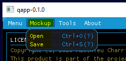
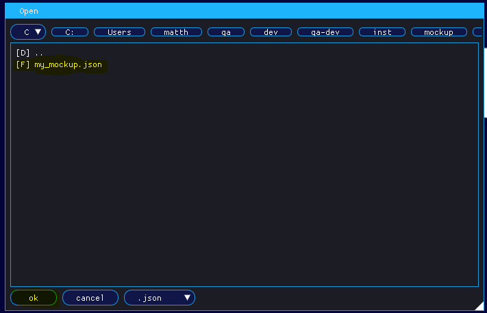
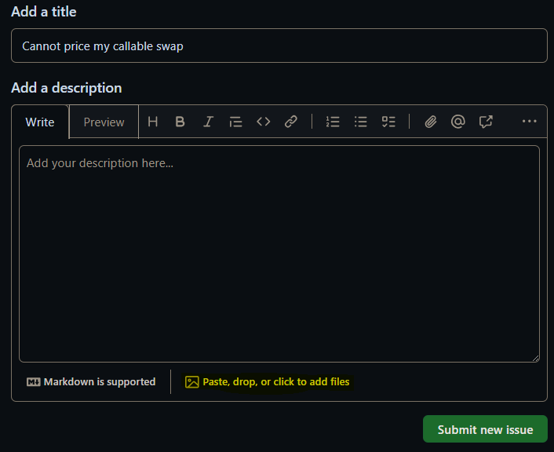

# 📺 How can I report my issue ?

`qapp` uses json format to serialize the state of a graphical interface. A `mockup` is a json file that is the result of this serialization. At any moment during your experience with `qapp`, you can open or save a `mockup` either to report an issue or for your own personnal needs.

- To save a `mockup`, go to <em>Mockup/Save</em> (or just press 'ctrl+S') and choose the `mockup` you want to save.

- To open a mockup, go to <em>Mockup/Open</em> (or just press 'ctrl+O') and choose the `mockup` you want to open.

  

    
  

</a>

  

    
  

</a>

- If you want to report an issue, just go to [Issue](https://GitHub.com/matt-charr/qa-demo/issues) and drop your `mockup` file together with your contract cpp/json files and data files if any.

  

    
  

</a>