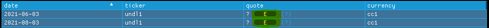
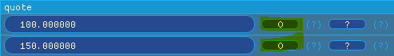
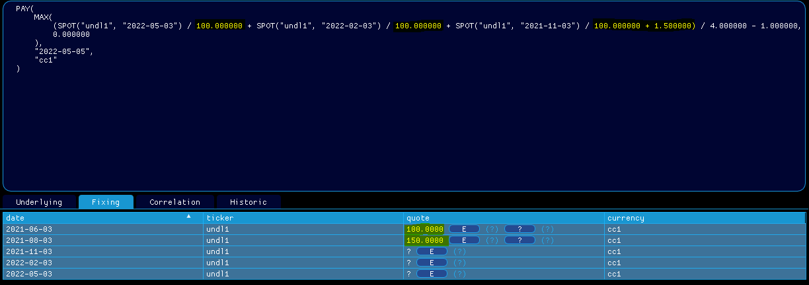

# 📺 How can I edit my fixings ?

> [!NOTE]
> Enjoy the below experience by opening the `mockup` [features/how-can-i-edit-my-fixing/mockup.json](mockup.json) in `qapp`
<strong>contract cpp file</strong>: [contracts/asian_call.json](../contracts/asian_call.cpp)

1. Load the contract json file <em>examples/asian_call.json</em> (see [How to load my contract ?](../features/how-can-i-load-my-contract/doc.md)), set your premium currency at <em>cc1</em> and your pricing date at <em>2021-05-03</em>

2. You can turn a fixing from stochastic to deterministic and vice-versa: Go to <em>Fixing</em>, set the first fixing at <em>100</em>, the second at <em>150</em> and click on <em>S</em>

  

    
  

  

    
  

3. Observe that your contract has been modified accordinly.

  

    
  

