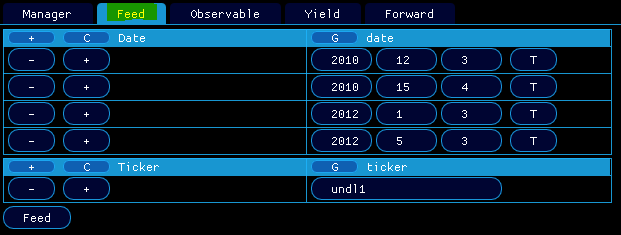

# 📺 How can I feed my data sources ?

> [!NOTE]
> Enjoy the below experience by opening the `mockup` [features/how-can-i-feed-my-data-sources/mockup.json](mockup.json) in `qapp`

In <em>Data/Feed</em>, you can populate all the databases contained in your sources (see [How can I manage my data sources ?](../features/how-can-i-manage-my-data-sources/doc.md)) using external market data providers like Yahoo Finance.

  

    
  

Here if you click on <em>feed</em> and if your network connection is ok, `qa` will request its (simple but effective) embedded Yahoo Finance API to get the spot of <em>undl1</em> at <em>2010-05-03</em>, <em>2010-11-03</em>, <em>2011-05-03</em> and <em>2012-05-03</em>. Eventually, the found quotes will be sent to all the databases you provided in your sources (see [How can I manage my data sources ?](../features/how-can-i-manage-my-data-sources/doc.md)).

For <em>undl1</em> to be recognized as a well known underlying by Yahoo Finance API, you need to attach a specific yahoo finance ticker to it, which is done by providing the following statement in your market data file:

  

    
  

Eventually, a file containing all the successfull results is thrown by `qapp`:

  

    
  

