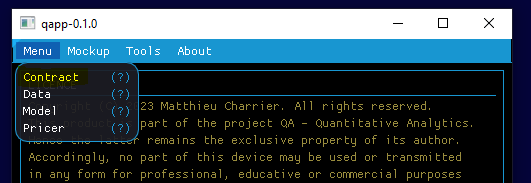
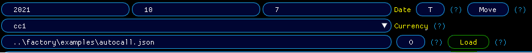
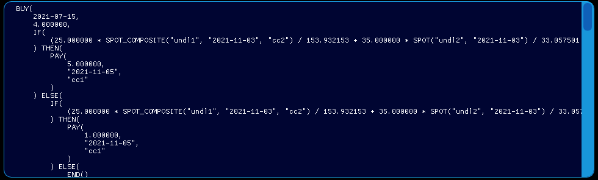
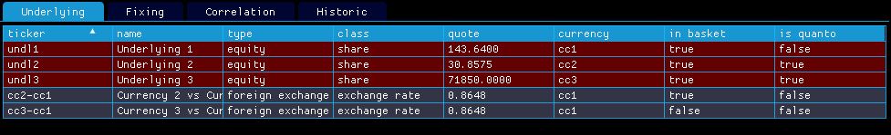
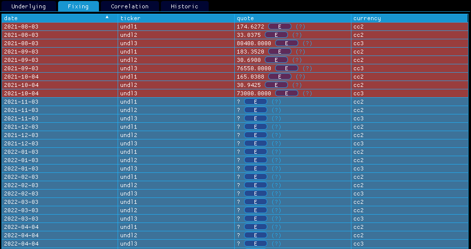
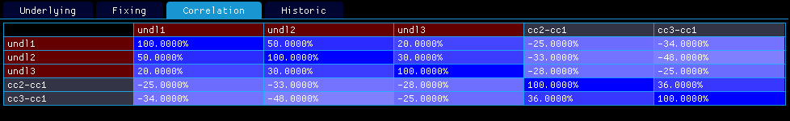
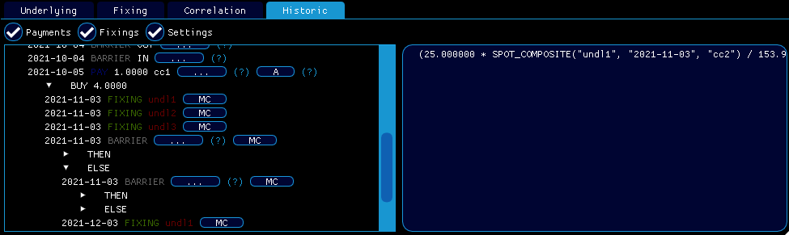

# 📺 How can I load my contract ?

> [!NOTE]
> Enjoy the below experience by opening the mockup [features/how-can-i-load-my-contract/mockup.json](mockup.json) in `qapp`
<strong>contract cpp file</strong>: [contracts/autocall.cpp](../contracts/autocall.cpp)

1. Go to <em>Menu/Contract</em>

  

    
  

2. Input your pricing date, premium currency and the contract json file <em>examples/autocall.json</em> then click on <em>load</em>. Be aware that your contract will be automatically moved to your pricing date (see [How can I move my contract ?](../features/how-can-i-move-my-contract/doc.md)).

  

    
  

3. You can now inspect the script, observe contract fixings and underlyings together with their correlation matrix, eventually you have a complete view on the contract past/future lifetime events i.e. fixings, payments, barriers, purchases, sells and also settings.

  

    
  

  

    
  

  

    
  

  

    
  

  

    
  

