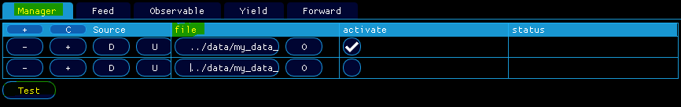
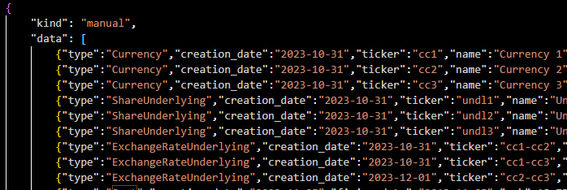
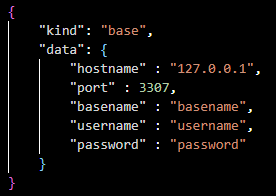
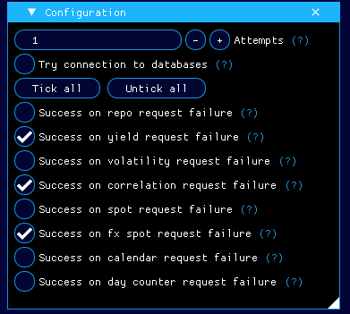

# 📺 How can I manage my data sources ?

Most of the actions triggered by `qapp` require market data. For instance, this is the case when you load your contract (see [How can I load my contract ?](../features/how-can-i-load-my-contract/doc.md)) or when you exit your fixings (see [How can I edit my fixings ?](../features/how-can-i-load-my-contract/doc.md)) where at inception, `qa` first asks for the market data that he needs to perform the action.
In <em>Menu/Data/Manager</em>, you can control which sources `qa` is going to use and set their rank in the list of priorities.

  

    
  

A source file must contain a list of source kinds. Each source kind describes a target source.
- You can provide several <strong>manual</strong> source kind which consists in a list of statements that describe manually the data type and attributes.

  

    
  

- If you have a MariaDB client installed in your machine, you can also provide a bunch of <strong>base</strong> source kind which consists in database connection parameters.

  

    
  

By default, you have only access to the example of data contained in <em>data/my_data_file.json</em>. If you allow connection to databases, have a client installed in your machine and a good network connection, `qa` will rather fetch the same data in a "demo" database located on a remote server (which can provide better performance for selection requests).

The rule goes this way: Let say you have provided N data sources { S1, S2, S3, ..., SN} and you request a market data item M. For instance, it can be a spot, an underlying, a currency.
- If M is missing in S1 then `qa` will request it in S2.
- If M is missing in S2 then `qa` will request it in S3.
- ...

You can check out the section <em>Data/Configuration</em> to inspect some additional parameters together with their respective description.

  

    
  

