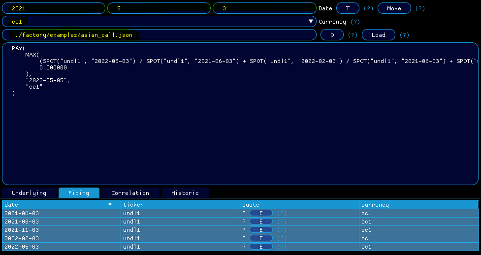
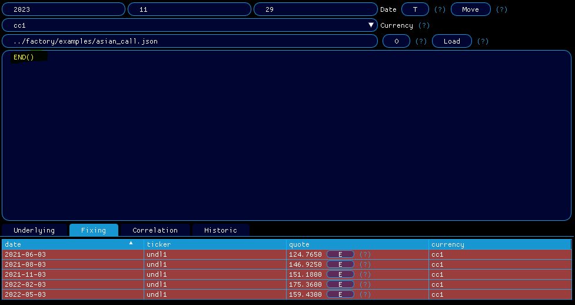

# 📺 How can I move my contract ?

> [!NOTE]
> Enjoy the below experience by opening the mockup [features/how-can-i-move-my-contract/mockup.json](mockup.json) in `qapp`
> <strong>contract json file</strong>: [contracts/asian_call.json](../contracts/asian_call.cpp)

1. Load the contract json file <em>examples/asian_call.json</em> (see [How to load my contract ?](../features/how-can-i-load-my-contract/doc.md)), set your premium currency at <em>cc1</em> and your pricing date at <em>2021-05-03</em>

  

    
  

2. Set your pricing date at <em>2022-03-03</em> and click on <em>Move</em>

3. Observe that your contract has been moved with success.

  

    
  

4. Now move your contract to today.

  

    
  

5. As expected, the contract is expired.

  

    
  

